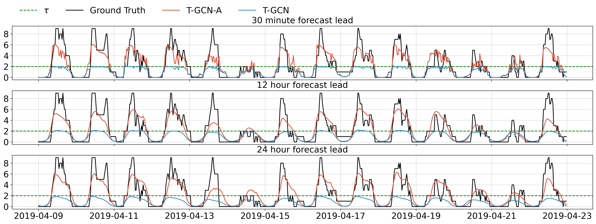
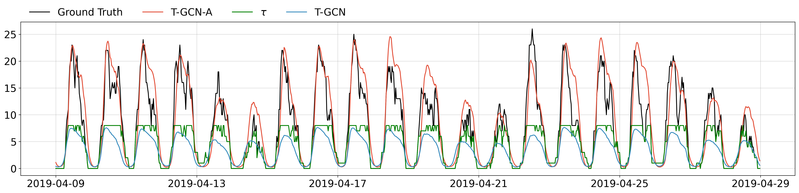

# Thesis

[](https://github.com/Fiskehandleren/Thesis/actions/workflows/models.yml)

## How to train TGCN

### T-GCN-A

Below command trains a T-GCN-A model on Static 2 censor strategy

```bash
python main.py --model_name TGCN \
    --train_start 2017-01-01 --train_end 2018-10-01 --val_end 2019-04-01 --test_end 2019-07-01 \
    --covariates --batch_size 256 --max_epochs 20 --sequence_length 336 \
    --hidden_dim 512 --forecast_lead 48 --forecast_horizon 1 \
    --use_activation --weight_decay 0.0001 --lr 0.0001 \
    --censored --dataloader EVChargersDatasetSpatial --loss CPNLL \
    --censor_level 2 --adjecency_threshold 1.5
```

### T-GCN

```bash
python main.py --model_name TGCN \
    --train_start 2017-01-01 --train_end 2018-10-01 --val_end 2019-04-01 --test_end 2019-07-01 \
    --covariates --batch_size 256 --max_epochs 20 --sequence_length 336 \
    --hidden_dim 512 --forecast_lead 48 --forecast_horizon 1 \
    --use_activation --weight_decay 0.0001 --lr 0.0001 \
    --dataloader EVChargersDatasetSpatial --loss PNLL \
    --censor_level 2 --adjecency_threshold 1.5
```

## How to train censored AR

```bash
python main.py --model_name AR \
    --train_start 2017-01-01 --train_end 2018-10-01 --val_end 2019-04-01 --test_end 2019-07-01 \
    --batch_size 32 --max_epochs 10 --dataloader EVChargersDataset  --censored --loss CPNLL --cluster WEBSTER
```

## Predict

`--pretrained` takes either a model path from Wandb or a local path to a model checkpoint. When running `--mode predict` you can pass the config of the dataset you want to model to run on. Here the sequence length and forecast lead should match the model. The model will predict on the test period.

```bash
python main.py --mode predict --pretrained fiskehandleren/Thesis/model-232ybnqc:v1 \
    --model_name TGCN \
    <other arguments given during training>
```

## Note on censored datasets:

- `charging_session_count_1_to_30_censored_2.csv`: observations capped at value 2
- `charging_session_count_1_to_30_censored_3.csv`: observations capped at value 3
- `charging_session_count_1_to_30_censored_2_dynamic.csv`: observations capped at 2 below maximum number of plug (when maximum #number of plugs is equal or above 2)
- `charging_session_count_1_to_30_censored_1_dynamic.csv`: observations capped at 1 below maximum number of plug (when maximum #number of plugs is equal or above 2)

## Results

### T-GCN

Predictions for the Bryant cluster using T-GCN-A with 30-minute, 12 hour and 24 hour forecast leads. The model is trained on the Static 2 censor strategy.


Aggregated for the clusters Webster, Bryant, Hamilton and High using T-GCN-A with 24 hour forecast leads. The model is trained on the Static 2 censor strategy.

